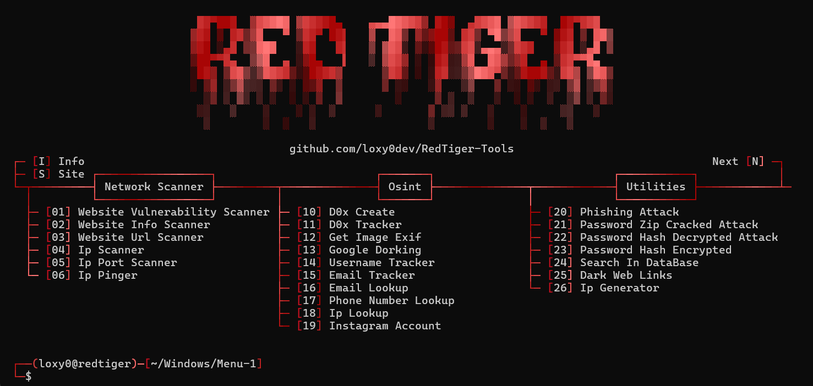
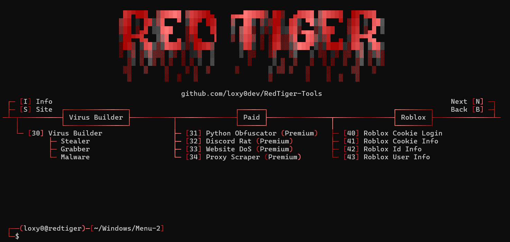
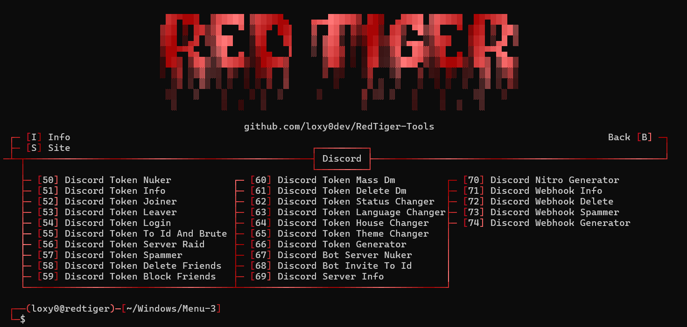
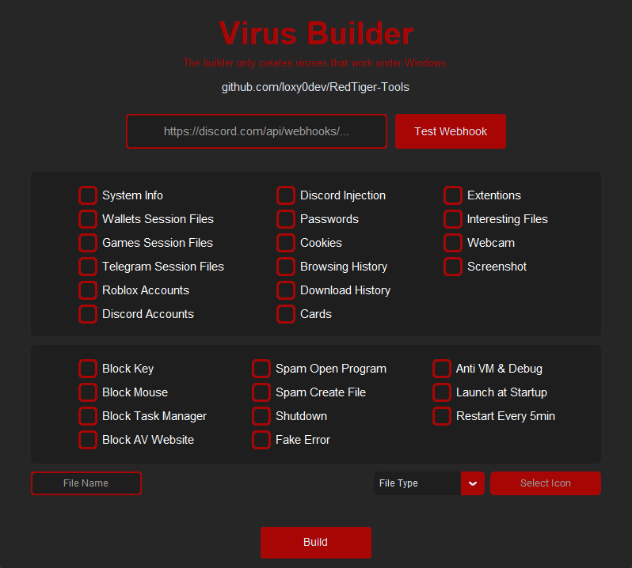

 

<h1 align="center">Multi-Tools</h1>

<p align="center">
   <a href="">Telegram</a> ・ <a href="https://guns.lol/mert848">GunsLol</a> ・ <a href="">Reviews</a>
</p>

<p align="center">
  
  
  
  
</p>

<p>
  
  - Developed in <strong>Python</strong>, by <a href="https://guns.lol/mert848">mert848</a><br>
  - Tool in <strong>English</strong>.<br>
  - Available on <strong>Windows</strong> and <strong>Linux</strong>.<br>
  - <strong>No malware</strong> or <strong>backdoor</strong>.<br>
  - <strong>Open Source</strong> only for verification, ensuring no malicious programs.<br>
  - <strong>Frequently updated</strong>.<br>
  - <strong>Free</strong> for everyone.<br>
  - The tools include: <strong>Scanning, Osint, Utilities, Builder, Roblox, Discord</strong>, And more..
  <br><br>
</p>

<h1 align="center">Disclaimer</h1>

<p>
  
  - RedTiger Tools has been developed solely for educational purposes.<br>
  - This project has been created with good intentions and is intended for personal use only.<br>
  - By choosing to use RedTiger, you acknowledge and accept full responsibility for any consequences that may result from your actions.<br>
  - All scripts in the "<a href="https://github.com/loxy0dev/RedTiger-Tools/tree/main/Program/FileDetectedByAntivirus">Program/FileDetectedByAntivirus</a>" folder are <strong>detected by the antivirus</strong> but pose no threat to you. These are <strong>not backdoors or malware</strong>.
<br><br>
</p>


<h1 align="center">Tools</h1>

<p align="center">
   
   
   
  
  <br><br>
</p>

<h1 align="center">Features</h1>
<p>
   
```
┌── ⚒️ - RedTiger-Tools
│   ├── Info
│   └── Site
│
├── 💰 - Paid
│   ├── Python Obfuscator (Premium)
│   ├── Discord Rat (Premium)
│   ├── Stresser DoS (Premium)
│   └── Proxy Scraper (Premium)
│
├── 🕵️‍♂️ - Network Scanner
│   ├── Sql Vulnerability Scanner
│   ├── Website Scanner
│   ├── Website Url Scanner
│   ├── Ip Scanner
│   ├── Ip Port Scanner
│   └── Ip Pinger
│
├── 🔎 - Osint
│   ├── D0x Create
│   ├── D0x Tracker
│   ├── Get Image Exif
│   ├── Google Dorking
│   ├── Username Tracker
│   ├── Email Tracker
│   ├── Email Lookup
│   ├── Phone Number Lookup
│   ├── Ip Lookup
│   └── Instagram Account
│
├── 🔧 - Utilities
│   ├── Phishing Attack
│   ├── Password Zip Cracked Attack
│   ├── Password Decrypted Attack
│   ├── Password Encrypted
│   ├── Search In DataBase
│   ├── Dark Web Links
│   └── Ip Generator
│
├── ☠️ - Virus Builder
│   ├── Stealer
│   │   ├── System Info            : User, System, Ip, Disk, Screen, Location, And more..
│   │   ├── Wallet Session Files   : Electrum, Exodus, Binance, Crypto.com, Trust Wallet, Atomic Wallet, Coinbase Wallet, Guarda, Bytecoin, Armory, Jaxx Liberty, Coinomi, AtomicDEX, Wasabi Wallet, Ledger Live, Trezor Suite, Blockchain Wallet, Mycelium, BRD, Zerion
│   │   ├── Games Session Files    : Steam, Riot Games, Epic Games, Rockstar Games
│   │   ├── Apps Session Files     : Telegram
│   │   ├── Roblox Accounts        : Cookie, Id, Username, And more..
│   │   ├── Discord Accounts       : Token, Email, Phone, Id, Username, Billing, And more..
│   │   ├── Discord Injection      : Email/Password Changed, Login, Card/Paypal Added, Nitro Bought, And more..
│   │   ├── Passwords              : Url, Email, Password
│   │   ├── Cookies                : Url, Cookie, Expire
│   │   ├── Browsing History       : Url, Title, Time
│   │   ├── Download History       : Url, Path
│   │   ├── Cards                  : Name, Expiration Month, Expiration Year, Card Number, Date Modified
│   │   ├── Extentions             : Metamask, Binance, Coinbase, ExodusWeb3, Phantom, Trust, Ronin, Venom, Sui, Martian, Tron, Petra, Pontem, Fewcha, Math, Coin98, Authenticator, Core, Tokenpocket, Safepal, Solfare, Kaikas, iWallet, Yoroi, Guarda, Jaxx Liberty, Wombat, Oxygen, MEWCX, Guild, Saturn, TerraStation, HarmonyOutdated, Ever, KardiaChain, PaliWallet, BoltX, Liquality, XDEFI, Nami, MaiarDEFI, TempleTezos, XMR.PT, And more..
│   │   ├── Interesting Files      : Download the files that are interesting.
│   │   ├── Camera Capture         : Record the victim's computer camera.
│   │   └── Screenshot             : Capture the victim's computer screen.
│   │
│   └── Malware
│       ├── Block Key
│       ├── Block Mouse
│       ├── Block Task Manager
│       ├── Block AV Website
│       ├── Shutdown
│       ├── Spam Open Program
│       ├── Spam Create File
│       ├── Fake Error
│       ├── Launch At Startup
│       ├── Anti Vm & Debug
│       └── Restart Every 5min
│
├── 📞 - Discord Tools
│   ├── Token Discord
│   │   ├── Discord Token Info
│   │   ├── Discord Token Nuker
│   │   ├── Discord Token Joiner
│   │   ├── Discord Token Leaver
│   │   ├── Discord Token Login
│   │   ├── Discord Token To Id And Brute
│   │   ├── Discord Token Server Raid
│   │   ├── Discord Token Spammer
│   │   ├── Discord Token Delete Friends
│   │   ├── Discord Token Block Friends
│   │   ├── Discord Token Mass Dm
│   │   ├── Discord Token Delete Dm
│   │   ├── Discord Token Status Changer
│   │   ├── Discord Token Language Changer
│   │   ├── Discord Token House Changer
│   │   ├── Discord Token Theme Changer
│   │   └── Discord Token Generator
│   │
│   ├── Bot Discord
│   │   ├── Discord Bot Server Nuker
│   │   └── Discord Bot Invite To Id
│   │
│   ├── Webhook Discord
│   │   ├── Discord Webhook Info
│   │   ├── Discord Webhook Delete
│   │   ├── Discord Webhook Spammer
│   │   └── Discord Webhook Generator 
│   │
│   ├── Discord Server Info
│   └── Discord Nitro Generator
│
└── 🎮 - Roblox Tools
    ├── Roblox Cookie Login
    ├── Roblox Cookie Info
    ├── Roblox User Info
    └── Roblox Id Info


```
<br><br>
</p>

<h1 align="center">Requirements</h1>

<h3>Windows:</h3>

<p>
- Install <a href="https://www.python.org/downloads/">Python</a> with the <a href="Img/Python_Path.png">PATH</a> options.<br>
- Windows 10 & 11 or +
</p>

<h3>Linux:</h3>

<p>
- Latest version of <a href="https://www.python.org/downloads/">Python</a>.<br>
- Linux recent version.
<br><br>
</p>

<h1 align="center">Installation</h1>

<a href="https://github.com/mertkucukel8/Redtiger.git">Dowloads "RedTiger.zip" Here</a>
<p>
  
```
1 - Download the .zip folder.
2 - Unzip the folder.
3 - Launch "Setup.py".
```
Or
```
1 - Open a terminal.
2 - Write "git clone https://github.com/mertkucukel8/Redtiger.git"
3 - Write "cd RedTiger-Tools"
4 - Write "git pull"
5 - Write "python Setup.py"
```
<br><br>
</p>
